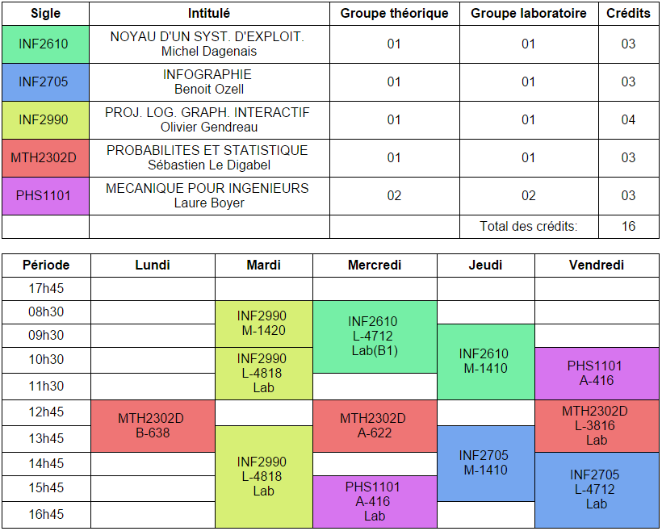

PolyHoraireFormat
=================

Cleans up the html generated by the Dossier Etudiant of Polytechnique
Depends on BeautifulSoup for xml tree manipulation

Instructions
------------

Save your Polytechnique schedule as Horaire.htm in the same location as the script
Execute the script
It will generate two files:
* result.html : The cleaned up and prettyfied html of the shedule
* result.css  : Rules for the table alignement and the colors (editable to your preference)

