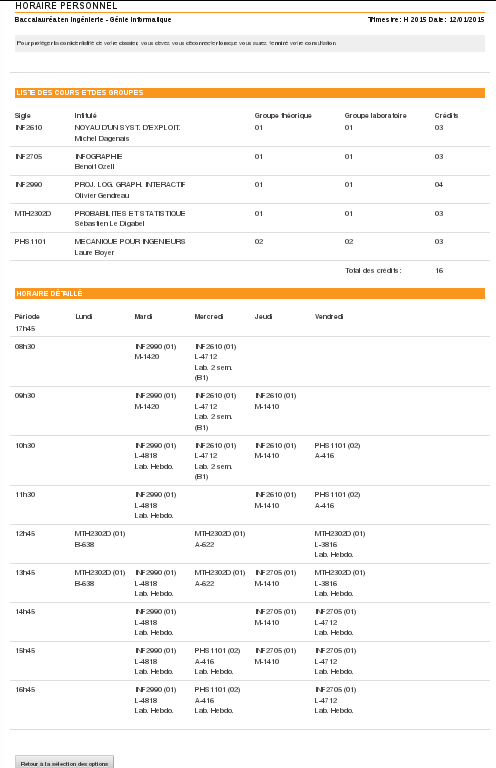

PolyHoraireFormat
=================

Cleans up the html generated by the Dossier Etudiant of Polytechnique

Depends on BeautifulSoup for xml tree manipulation

Instructions
------------

Save your Polytechnique schedule as an .htm
Call the program with the path of the .htm as the only argument

Output
------

The program will generate two files:
* result.html : The cleaned up and prettyfied html of the shedule
* result.css  : Rules for the table alignement and the colors (editable to your preference)

Before and after screenshots
----------------------------

Before

After

